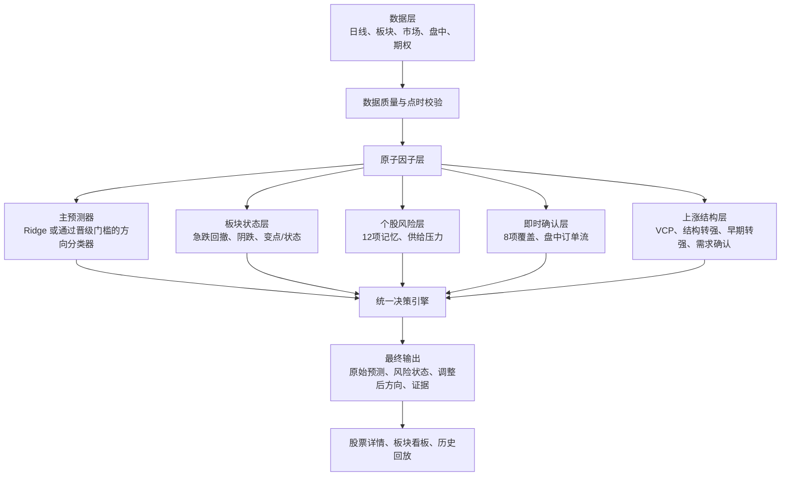

# 统一量化模型与走势决策架构

## 1. 文档目标

本文定义股票分析系统的统一模型架构，回答四个问题：

1. 系统现在有哪些模型，后续计划增加哪些模型；
2. 每个模型解决什么问题、依赖哪些因子、输出什么结果；
3. 多个模型发生冲突时如何形成最终走势结论；
4. 如何通过严格的时间序列回测决定模型和阈值是否可以上线。

系统不把多个模型当作同等权重的投票者。最终架构采用：

> 一个主预测器 + 板块状态模型 + 个股持续风险模型 + 即时确认模型 + 上涨结构辅助模型 + 统一决策层。

主预测器负责条件期望收益或方向；其余模型负责识别主预测器容易遗漏的状态切换、尾部回撤、持续阴跌、供需变化和结构性机会。

## 2. 核心设计原则

### 2.1 原始预测与风险调整必须分开

界面和 API 必须同时保留：

- 主模型原始预测收益；
- 主模型原始方向；
- 每个风险模型的独立输出；
- 风险调整后的最终方向；
- 调整原因和触发证据。

不允许把正的 Ridge 收益率静默改成“下跌”，也不允许在风险层已经否决上涨后继续画一条向上的“最终预测线”。

### 2.2 收益预测和回撤风险是不同任务

未来平均收益为正，不代表路径中不会先发生大幅回撤。因此系统至少需要分别建模：

- 未来收益；
- 未来终点方向；
- 未来最大不利波动或最大回撤；
- 当前所处趋势状态；
- 上涨结构是否正在形成。

### 2.3 规则分数不是概率

8 项即时覆盖、12 项记忆风险、VCP、反转候选等规则模型输出的是规则分数或状态，不能标记为“上涨概率”或“下跌概率”。

只有经过样本外校准，并满足样本数和正负类别覆盖要求的统计模型，才可以输出概率。

### 2.4 所有历史预测必须是点时可用的

日期 \(t\) 的预测只能使用日期 \(t\) 收盘前已经存在的数据。训练样本的标签结束日期必须严格早于预测日期。任何标准化、缺失值填充、截尾和阈值选择只能在训练窗口内完成。

### 2.5 风险具有非对称决策权

上涨结构模型可以提高上涨置信度，但不能覆盖高等级下跌风险。经过样本外验证的高等级下跌风险可以降级或否决主模型的上涨结论。

## 3. 总体架构



## 4. 模型清单

| 编号 | 模型 | 状态 | 核心任务 | 是否直接决定最终方向 |
| --- | --- | --- | --- | --- |
| M1 | Ridge 收益率模型 v4 | 生产中 | 预测未来 5/20/60 个交易日条件期望收益 | 是，作为当前主预测器 |
| M2 | 直接方向分类器 | 研究实现 | 预测未来方向类别 | 通过晋级门槛后可替代 M1 的方向职责 |
| M3 | 近期加权动量挑战模型 | 已设计、待完成实验 | 降低远期动量压倒近期转弱的问题 | 仅在通过晋级门槛后进入主预测器 |
| M4 | 半导体板块急跌/回撤模型 | 计划 | 预测板块未来 5～10 日显著回撤风险 | 可降级或否决上涨 |
| M5 | 软件板块持续阴跌模型 | 计划 | 识别低速负漂移、弱反弹和长期相对走弱 | 可将中性或上涨降级为向下风险 |
| M6 | 板块变点/状态模型 | 计划 | 识别上涨、派发、阴跌、恐慌等持续状态 | 作为板块风险背景和记忆 |
| M7 | 12 项向下转折记忆模型 | 已实现展示，未接入决策 | 识别市场、板块、个股风险并保留 5～10 日记忆 | 计划接入降级和联合否决 |
| M8 | 8 项即时下跌覆盖模型 | 已实现 | 判断当日是否已出现强烈破位确认 | 当前达到 70 分会否决 Ridge 上涨 |
| M9 | 上涨结构反转候选 | 已实现 | 判断突破前高、突破趋势线、更高低点三项结构 | 只辅助，不覆盖高风险 |
| M10 | 向上早期反转观察 | 已实现 | 观察大跌后的价格接受、趋势线接近和量能支持 | 只辅助，不直接反转最终方向 |
| M11 | VCP/紧密平台突破准备模型 | 已实现 | 识别波动收缩和突破准备形态 | 只提高上涨准备置信度 |
| M12 | 供给压力模型 | 计划 | 识别上涨过程中的派发、滞涨、抛压和失败突破 | 可提高持续风险 |
| M13 | 需求确认模型 | 计划 | 识别强收盘、吸收卖压、突破接受和买盘确认 | 可提高上涨置信度 |
| M14 | 盘中订单流模型 | 数据基础已预留、待接入完整数据 | 识别主动买卖、订单失衡、吸收和流动性撤离 | 作为即时确认，不单独决定中长期方向 |

## 5. 主预测器

### 5.1 M1：Ridge 收益率模型 v4

#### 目标

分别预测未来 5、20、60 个交易日的终点收益率。

#### 当前输入因子

**趋势与位置**

- 收盘价相对 EMA20；
- 收盘价相对 SMA50；
- 收盘价相对 SMA200；
- 距离 20 日枢轴点；
- 突破前高；
- 突破下降趋势线；
- 更高低点确认。

**动量**

- 3–1 月动量；
- 6–1 月动量；
- 12–1 月动量。

这些传统动量主动跳过最近约 21 个交易日，因此容易遗漏最新的派发和转弱。

**成交量与波动**

- 成交量/20 日均量；
- 成交量日变化；
- ATR20 占价格比例；
- 63 日实现波动率。

**结构**

- 严格 VCP；
- 紧密平台。

**供给压力代理**

- 收盘位置；
- 上影线比例；
- 有符号成交量代理；
- 派发日；
- 突破失败。

**市场与板块**

- QQQ 趋势状态；
- 板块相对 QQQ 的 20 日强弱；
- 个股相对板块的 20 日强弱。

#### 当前缺陷

- 直接拟合原始收益，容易受极端上涨标签影响；
- 线性模型不能自然表达“涨幅过大后风险反而上升”；
- 传统动量跳过最近一个月；
- 只预测终点收益，不预测路径回撤；
- 非半导体股票缺少有效板块映射；
- QQQ 连续收益、QQQ 成交量和板块宽度尚未完整进入生产特征；
- 同一个混合股票池容易把高波动成长股的历史反弹规律错误应用到派发阶段。

#### 输出

- `predicted_return`；
- `raw_direction`；
- 训练样本数和训练截止日期；
- 经过有效校准后才允许提供的上涨概率。

### 5.2 M2：直接方向分类器

#### 目标

直接预测未来 5/20 日的 `up / neutral / down`，避免先拟合收益再用固定中性带转换方向。

#### 输入

- M1 的原子因子；
- 连续 QQQ 收益与成交量；
- 板块趋势和相对强度；
- 个股供给压力原子条件；
- 近期动量特征；
- 可用性和缺失状态标记。

#### 晋级条件

只有在扩展窗口走步验证中，同时改善平衡准确率、宏平均 F1 和下跌召回率，并在多数时间折、半导体子集和最新留出时段保持稳定，才可以替代 Ridge 的方向职责。

### 5.3 M3：近期加权动量挑战模型

#### 目标

让最近 1～20 日的价格、成交量和市场状态比更远历史获得更高权重，解决 MU、INTC、NBIS、MRVL 在长期动量极强时持续被预测上涨的问题。

#### 因子

- 1～3 日指数衰减动量；
- 4～10 日指数衰减动量；
- 11～20 日指数衰减动量；
- 21～60 日指数衰减动量；
- 1～20 日综合衰减动量；
- 动量 × 成交量确认；
- 动量 × 收盘位置；
- 个股相对 QQQ 的衰减动量；
- 个股相对板块的衰减动量；
- 个股、板块、QQQ 的方向一致性。

第一阶段使用正则化线性或逻辑模型，只有这些特征证明有增量价值后，才研究因果注意力序列模型。

## 6. 板块状态模型

### 6.1 M4：半导体板块急跌/回撤模型

#### 目标

输出：

- 未来 5 日收益低于指定下跌阈值的概率；
- 未来 10 日最大回撤超过指定阈值的概率；
- 板块急跌风险等级。

阈值通过训练和验证区间选择并版本化，不使用 MU、NBIS、MRVL 等单独案例调参。

#### 因子

**板块宽度**

- 上涨股票比例；
- 下跌股票比例；
- EMA20 上方股票比例；
- SMA50 上方股票比例；
- 20 日新高和新低比例；
- 突破成功与失败比例。

**成交量宽度**

- 上涨成交量与下跌成交量占比；
- 放量派发股票比例；
- 板块平均成交量比率；
- 高成交量但价格没有进展的股票比例；
- 连续 5/10/20 日派发累计。

**板块价格与相对强度**

- 半导体成分股等权收益；
- SOXX 和 SMH 的 1/5/20 日收益；
- SOXX/SMH 相对 QQQ 和 SPY 的强弱；
- 板块趋势斜率；
- 板块波动率、下行波动率和 ATR；
- 成分股相关性和横截面离散度。

**个股向板块传导**

- 龙头股率先跌破 EMA20/SMA50 的比例；
- 高权重股票风险；
- 个股相对板块强度破位数量；
- AI 基础设施相关股票与传统半导体的风险共振。

#### 推荐实现

先使用正则化逻辑回归建立可解释基线，再使用浅层 XGBoost 挑战。主要目标是尾部回撤分类，不与 Ridge 的平均收益目标混用。

### 6.2 M5：软件板块持续阴跌模型

#### 目标

识别 ADBE 一类低速负漂移、反弹乏力、长期跑输板块的状态。输出：

- 未来 10/20 日持续阴跌风险；
- 当前是否处于负漂移状态；
- 反弹失败程度；
- 相对板块恶化程度。

#### 个股因子

- 5/10/20 日回归斜率及斜率显著性；
- EMA20、SMA50 自身斜率；
- 连续处于 EMA20/SMA50 下方的交易日；
- 过去 10/20 日下跌天数比例；
- 更低高点和更低低点的持续次数；
- 当前回撤幅度和回撤持续天数；
- 下跌成交量/上涨成交量；
- 反弹幅度/此前下跌幅度；
- 反弹成交量/下跌成交量；
- 反弹是否无法收复 EMA20、SMA50 或前高；
- 弱反弹后的再次破位；
- 相对软件板块与 QQQ 的 5/20/60 日强弱。

#### 板块因子

- 软件股票中 EMA20/SMA50 上方比例；
- 软件板块上涨/下跌成交量宽度；
- 软件股新低比例；
- 软件股等权收益；
- 软件板块相对 QQQ 和 XLK 的强弱；
- IGV、XSW 等软件代理的趋势、成交量和波动；
- 软件龙头之间的同步性。

#### 状态

- 健康上涨；
- 高位派发；
- 持续阴跌；
- 恐慌下跌/超跌反弹。

### 6.3 M6：板块变点/状态模型

#### 目标

为板块提供有记忆的背景状态，防止一两日反弹立即清除风险。

#### 候选方法

- Bayesian Online Changepoint Detection：检测生成机制何时变化；
- Hidden Markov/Markov Switching：估计当前属于哪个持续状态。

两者独立走步回测；生产环境只保留样本外稳定性更好的方法，或明确分工为“变点发现 + 状态持续”。

#### 输入

- 板块等权收益；
- 板块宽度；
- 下跌成交量比例；
- 放量派发比例；
- 相对 QQQ 强弱；
- 波动率和相关性；
- 板块回撤；
- 板块流动性代理。

#### 输出

- 当前状态；
- 状态持续天数；
- 状态切换概率或变点概率；
- 状态置信等级；
- 主要状态证据。

## 7. 个股下跌风险模型

### 7.1 M7：12 项向下转折记忆模型

#### 当前 12 项因子

**市场**

1. QQQ 跌破 EMA20；
2. QQQ 20 日派发次数上升。

**板块**

3. 板块 5 日相对收益为负；
4. 板块 20 日相对强度斜率为负。

**个股**

5. 突破失败；
6. 跌破 EMA20；
7. 跌破 SMA50；
8. 个股相对板块强度破位；
9. 放量派发；
10. 高成交量但价格没有进展；
11. 上影线供给压力；
12. 有符号成交量代理转负。

#### 记忆机制

- 当前原始风险与历史风险分开；
- 半衰期 5 个交易日；
- 最长记忆 10 个交易日；
- 状态包括 `new / persistent / fading / inactive / unavailable`；
- 当前激活线为 20 分；
- 计划增加进入阈值高于退出阈值的滞回机制，防止在阈值附近反复开关。

#### 当前状态

已经进入市场看板和股票历史悬停详情，但尚未接入 Ridge 最终方向决策。

### 7.2 M8：8 项即时下跌覆盖模型

#### 因子

1. 放量派发；
2. 跌破 EMA20；
3. 异常成交量；
4. 成交量扩张；
5. 收盘接近日内低位；
6. 主动卖压代理较强；
7. 跑输所属板块；
8. 突破失败。

#### 当前规则

当前分数达到 70 时，将 Ridge 原始上涨或中性方向覆盖为下跌。该分数只使用当日证据，没有记忆。

#### 计划职责

M8 不再独自承担全部否决责任，而是作为“当天确认”与 M4/M5/M6/M7 联合决策：

- 长期背景风险高 + 当日即时确认：强否决；
- 长期背景风险高 + 当日暂时反弹：保留风险，不恢复强上涨；
- 当日即时分高但背景风险低：先标记事件，避免单日噪声直接形成长期结论。

### 7.3 M12：供给压力模型

#### 因子

- 放量不涨；
- 单位成交量价格进展下降；
- 上影线拒绝；
- 日内突破前高后收回阻力位下方；
- 多次测试阻力但价格进展递减；
- 5/10/20 日派发累计；
- 相对强度先于价格恶化；
- EMA20 或更高低点被放量跌破；
- 跌破支撑后的弱量反弹；
- 下跌成交量逐步占优。

相关证据必须分组，避免同一根放量阴线同时获得多个完整权重。

## 8. 上涨结构和需求模型

### 8.1 M9：向上结构反转候选

三项条件：

- 突破前高；
- 突破下降趋势线；
- 更高低点确认。

显示满足数量，例如 `2/3`。它是价格结构规则，不是收益预测。

### 8.2 M10：向上早期反转观察

四项条件：

- 前一交易日明显抛售；
- 当前交易日价格重新获得接受；
- 接近或突破下降阻力线；
- 当前成交量提供支持。

它负责在确认反转之前提供观察点，不能单独覆盖高下跌风险。

### 8.3 M11：VCP/紧密平台突破准备

#### 严格 VCP 因子

- 中长期趋势；
- 基底深度；
- 两次以上波动收缩；
- 后一次收缩显著小于前一次；
- 接近 52 周高点；
- 枢轴点和延伸度；
- 成交量收缩。

#### 紧密平台因子

- 20 日价格区间；
- ATR 自适应范围；
- 平台内方向效率；
- 距离高点；
- 中长期均线结构。

VCP 表示上涨准备形态，不代表已经突破。

### 8.4 M13：需求确认模型

#### 因子

- 收盘接近日内高位；
- 上涨成交量占优；
- 突破后收盘接受；
- 突破后的次日跟随；
- 极端卖压但价格不再下跌；
- 主动卖压下价格仍能回收；
- 缩量回调后形成更高低点；
- 个股相对板块和 QQQ 转强；
- 主动买盘和价格进展一致。

#### 输出状态

- 健康上涨；
- 双向高成交量争夺；
- 派发风险；
- 低参与度整理；
- 需求确认。

## 9. 盘中订单流模型

### 9.1 M14：盘中订单流

#### 最低数据要求

- 逐笔成交；
- 同步的最优买卖报价；
- 成交修正和取消；
- 数据场所和覆盖范围；
- 可靠时间戳。

#### 因子

- 主动买入和主动卖出成交量；
- 成交量 Delta 和累计 Delta；
- 报价盘口失衡；
- 订单流失衡；
- 单位订单流的价格冲击；
- VWAP 上方和下方成交量；
- 买卖价差和流动性变化；
- 卖方吸收和买方吸收；
- 价格与订单流背离；
- 卖盘补充和买盘撤离；
- 开盘和收盘订单不平衡。

IEX 等部分市场数据必须明确标注覆盖不足，不能与完整 SIP 或全深度订单簿混称为“全市场买卖盘”。

## 10. 统一决策引擎

### 10.1 输入

决策引擎接收标准化的独立结果：

- 主预测器原始收益和方向；
- 板块急跌概率；
- 板块持续阴跌概率；
- 板块状态和状态持续时间；
- 12 项个股风险原始分和记忆分；
- 8 项即时确认分；
- 供给压力等级；
- 需求确认等级；
- 上涨结构事件；
- 数据覆盖率和模型可用性。

只有一个模型承担“主预测器”角色。其他模型不能通过简单多数票替代主预测器。

### 10.2 风险等级

每个板块和个股风险结果先映射为统一等级：

- `low`：没有足够下跌证据；
- `watch`：出现部分恶化，需要降低置信度；
- `high`：持续或多来源风险共振；
- `confirmed`：当日已出现破位确认。

规则分数的等级阈值和概率模型的概率阈值分别通过训练/验证区间确定，并保存模型版本、样本区间和配置版本。当前生产 8 项模型的 70 分阈值在新决策层上线前保持不变。

### 10.3 决策优先级

1. 检查数据可用性和点时完整性；
2. 记录主预测器原始结果；
3. 判断市场和板块状态；
4. 判断个股持续风险；
5. 检查当日即时确认；
6. 检查上涨结构和需求确认；
7. 应用降级或否决规则；
8. 输出最终方向、风险状态和完整解释。

### 10.4 冲突决策矩阵

| 主预测器 | 板块/个股风险 | 即时确认 | 上涨结构/需求 | 最终结论 |
| --- | --- | --- | --- | --- |
| 上涨 | 低 | 无 | 有 | 上涨，置信度增强 |
| 上涨 | 低 | 无 | 无 | 保留原始上涨 |
| 上涨 | 观察 | 无 | 任意 | 谨慎上涨，不画强上涨结论 |
| 上涨 | 高 | 无 | 任意 | 否决强上涨，降为中性或向下风险观察 |
| 上涨 | 高 | 有 | 任意 | 下跌风险优先，最终向下 |
| 上涨 | 已确认 | 有 | 任意 | 最终向下 |
| 中性 | 低 | 无 | 有 | 中性偏强，仅显示结构机会 |
| 中性 | 持续阴跌高 | 无或有 | 任意 | 最终向下风险，不能继续显示普通中性 |
| 中性 | 高 | 有 | 任意 | 最终向下 |
| 下跌 | 任意高风险 | 任意 | 任意 | 保留下跌 |
| 下跌 | 风险低 | 无 | 上涨结构初现 | 下跌趋势中的向上观察，不直接翻为上涨 |
| 下跌 | 风险低 | 无 | 需求确认且结构完成 | 降为中性，等待主预测器或确认模型转强 |

### 10.5 非对称覆盖规则

- 上涨结构模型不能把主预测器的下跌直接覆盖成上涨；
- 单日即时风险在背景风险低时不能自动生成长期下跌结论；
- 高板块风险与高个股持续风险共振时，可以否决主预测器上涨；
- 高持续风险即使当日反弹，也只能逐步衰减，不能立即恢复强上涨；
- 已确认的强破位对 5 日方向拥有最高优先级；
- 20/60 日仍可显示“中长期预期为正、短期风险很高”，但必须分开表达。

## 11. 最终输出契约

每个日期、每个预测周期至少输出：

```text
raw_forecast:
  model
  predicted_return
  raw_direction
  confidence_status

market_sector_state:
  market_state
  sector_state
  sector_drawdown_probability
  slow_decline_probability
  changepoint_probability

stock_risk:
  persistent_risk_score
  persistent_risk_state
  immediate_risk_score
  supply_pressure_state

bullish_evidence:
  structural_reversal_count
  early_reversal_state
  vcp_state
  demand_confirmation_state

decision:
  final_direction
  final_risk_state
  adjustment_action
  adjustment_reasons
  decision_model_version
```

当概率模型尚未通过校准门槛时，对应概率字段必须为不可用，并说明原因。

## 12. UI 展示

股票详情页需要分成四块：

1. **主模型原始预测**：Ridge 或晋级后的主预测器；
2. **板块与市场状态**：板块急跌、阴跌、变点和宽度；
3. **个股风险与结构**：持续风险、即时确认、供给、需求、VCP 和反转；
4. **风险调整后结论**：最终方向及为什么调整。

历史悬停必须锁定同一日期，展示当时真实可用的所有模型结果。不得使用今天的板块状态解释历史日期。

当原始预测与最终结论不同，界面应醒目标明：

> Ridge 原始预测上涨；由于板块回撤风险和个股持续风险共振，最终结论降级为向下风险。

## 13. 数据规划

### 13.1 立即可用

- 当前股票日线 OHLCV；
- QQQ、SPY、SOXX、SMH 和行业 ETF；
- 当前半导体成分组；
- 日线成交量宽度和价格宽度；
- 当前结构、动量、压力和反转因子。

### 13.2 优先补充

- 8～10 年复权日线；
- 拆股、分红和公司行动；
- 历史板块成分股，避免幸存者偏差；
- IGV、XSW 及软件股票组；
- FINRA 每日卖空成交量；
- 财报、业绩指引和分析师预测修正。

### 13.3 后续付费或券商数据

- SIP 全市场逐笔成交和报价；
- 个股期权成交、持仓、隐含波动率和偏度；
- Nasdaq TotalView/NOII；
- ETF 申购赎回和资金流；
- 借券费率和可借数量。

## 14. 回测与模型晋级

### 14.1 标签

分别评估：

- 5/20/60 日终点收益；
- 5/20 日方向；
- 未来 5 日显著下跌；
- 未来 10/20 日最大回撤；
- 持续阴跌状态；
- 反转观察后的最大有利和不利波动。

### 14.2 验证方法

- 扩展窗口走步验证；
- 标签边界清除；
- 下一交易日开盘作为可执行价格；
- 重叠和非重叠标签分别报告；
- 最新时间段独立留出；
- 全市场、板块、高波动和个股案例分层报告；
- 阈值只能在训练/验证数据中选择。

### 14.3 指标

- 平衡准确率；
- 下跌精确率和召回率；
- ROC AUC 和 PR AUC；
- Brier 分数和校准曲线；
- 收益 MAE 和 Rank IC；
- 最大回撤和最大不利波动；
- 换手率和信号持续时间；
- 相对简单基线的增量；
- 各时间折稳定性。

### 14.4 上线门槛

模型必须：

1. 在主指标上超过简单基线和当前生产模型；
2. 不以大幅牺牲上涨精确率换取下跌召回；
3. 在多数时间折中改善；
4. 在最新留出段和目标板块保持改善；
5. 对已知案例有解释力，但不能使用案例本身调参；
6. 通过数据因果性、缺失值、标签边界和 API 契约测试；
7. 提供模型版本、训练区间、特征版本和阈值版本。

失败的实验保留研究结果，但不进入生产决策层。

## 15. 实施顺序

### 阶段一：统一语义与决策层

- 同时展示 Ridge 原始预测和风险调整结论；
- 将 12 项记忆风险接入降级逻辑；
- 保留 8 项即时覆盖来源；
- 修复正收益率与最终下跌方向的图形矛盾；
- 为决策结果增加完整来源字段。

### 阶段二：板块日线风险

- 实现半导体板块宽度数据集；
- 实现未来回撤逻辑回归基线；
- 对比浅层 XGBoost；
- 实现板块状态记忆或变点模型；
- 回测 MU、INTC、NBIS、MRVL，但不针对这些股票调参。

### 阶段三：软件阴跌

- 增加软件板块映射和 IGV/XSW 数据；
- 实现负漂移、弱反弹和相对强度因子；
- 训练持续阴跌模型；
- 回测 ADBE、CRM、NOW、INTU 等软件股票。

### 阶段四：供需和近期动量

- 完成近期加权动量消融实验；
- 实现供给压力和需求确认；
- 重新评估主方向分类器；
- 只有通过晋级门槛才替换生产主预测器。

### 阶段五：盘中与衍生品

- 接入完整逐笔成交和报价；
- 实现订单流与吸收模型；
- 评估期权、卖空和深度盘口的增量价值；
- 只有证明样本外增益后才进入决策层。

## 16. 与现有 TODO 的关系

本文作为 `docs/modeling-todo.md` 的上层架构规范：

- TODO 记录具体研究和实现任务；
- 本文定义模型边界、输入输出和冲突决策；
- 每个新增模型应拥有独立设计、回测报告和实现计划；
- 任何模型职责或最终决策规则变化都必须同步更新本文。
